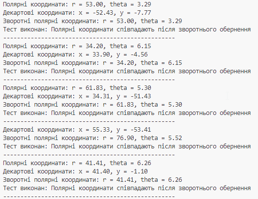
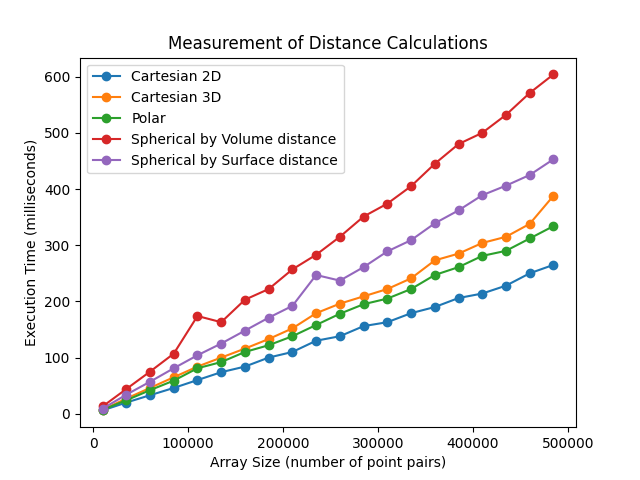

## Титул
## Реалізація перетворень між системами координат
## Виконав студент: Прокопенко Євгеній ІПЗ-4.04
## з дисципліни: **"Розробка та програмування координатних систем"**

## Мета роботи

Ознайомитися з різними системами координат (декартовою, полярною та сферичною) та отримати практичні навички у переході між ними. Визначити обчислювальну ефективність розрахунку відстаней у цих системах координат через бенчмаркінг.

## Завдання

Згідно до поставленого завдання необхідно було створити веб-додаток, що в реальному часі відображає дані про задетектовані цілі на графіку та дозволяє змінювати параметри радару.

1. **Перехід між системами координат:**

— Двовимірний простір: Декартова та полярна системи координат.
- Задати координати декількох точок у полярній системі координат;
- Перевести ці координати в декартову систему координат;
- Здійснити зворотний перехід з декартової системи координат в полярну;
- Перевірити коректність розрахунків, упевнившись, що вихідні координати співпадають з отриманими після зворотного перетворення.

— Тривимірний простір: Декартова та сферична системи координат.
- Задати координати декількох точок у сферичній системі координат;
- Перевести ці координати в декартову систему координат;
- Здійснити зворотний перехід з декартової системи координат в сферичну;
- Перевірити коректність розрахунків, упевнившись, що вихідні координати співпадають з отриманими після зворотного перетворення.

2. **Розрахунок відстаней у сферичній системі координат.** Виконати обчислення відстані між точками у сферичній системі координат двома способами:
- **Декартова система координат**: Використати стандартну формулу для обчислення прямої відстані у двовимірному та тривимірному просторі;
- **Полярна система координат**: Використати формулу для обчислення відстані між точками у двовимірному просторі;
- **Сферична система координат**: Виконати обчислення відстані між точками двома способами:

  a) **Через об'єм сфери**: використати формулу для прямої відстані у тривимірному просторі;

  б) **По поверхні сфери**: використати формулу для великої колової відстані.

3. **Бенчмарки продуктивності:**
- Згенерувати масив координат пар точок у кожній системі координат (декартова, полярна, сферична);
- Виконати розрахунок відстаней між цими точками для кожної системи координат;
- Виміряти тривалість обчислень для кожної системи координат;
- Обрати такий розмір масиву, за якого результат бенчмаркінгу матиме незначну варіативність від запуску до запуску (рекомендовано розмір масиву 10,000 - 100,000 точок).

## Розробка проєкта перетворень між системами координат

#### 1. Технології

Для реалізації проєкту з перетворень між системами координат було обрано мову програмування Python. Цей вибір обумовлений кількома вагомими причинами:

Легкість побудови графіків: Python надає зручні інструменти для візуалізації даних, такі як Matplotlib. Завдяки цій бібліотеці я зміг легко створювати графіки, що дозволяє наочно демонструвати перетворення між різними системами координат. Візуалізація допомагає краще зрозуміти геометричні зміни та просторові відношення між об'єктами.

Наукові дослідження: Python є популярним вибором у наукових колах, оскільки забезпечує простоту у виконанні математичних обчислень. У моєму проєкті я використав Python для обчислення відстаней між точками в різних системах координат, що є важливим аспектом для проведення наукових досліджень.

Об'єктно-орієнтоване програмування (OOP): Python підтримує об'єктно-орієнтоване програмування, що дозволяє створювати класи для різних систем координат (декартова, полярна, сферична). Це спростило управління даними та реалізацію методів для перетворення, що підвищує зручність і читабельність коду.

#### 2. Двовимірний простір: Декартова система координат

У файлі `src/cartesian2d.py` був створений клас `Cartesian2D`.

Цей клас представляє двомірні декартові координати і включає:
- Конструктор `__init__(self, x, y)`, який ініціалізує координати `𝑥` та `𝑦`;
- Метод `distance(self, other_point)`, що обчислює відстань до іншої точки в декартовій системі координат;
- Статичний метод `from_polar(r, theta)`, який створює об'єкт на основі полярних координат, перетворюючи їх у декартові.

#### 3. Тривимірний простір: Декартова система координат

У файлі `src/cartesian3d.py` був створений клас `Cartesian3D`.

Цей клас представляє тривимірні декартові координати і включає:

- Конструктор `__init__(self, x, y, z)`, який ініціалізує координати `𝑥`, `𝑦` та `𝑧`;
- Метод `distance(self, other_point)`, що обчислює відстань до іншої точки в тривимірному просторі;
- Статичний метод `from_spherical(r, theta, phi)`, який створює об'єкт на основі сферичних координат, перетворюючи їх у декартові.

#### 4. Двовимірний простір: Полярна система координат

У файлі `src/polar.py` був створений клас `Polar`.

Цей клас представляє полярні координати і включає:

- Конструктор `__init__(self, r, theta)`, який ініціалізує радіус `𝑟` та кут `𝜃`;
- Метод `distance(self, other_point)`, що обчислює відстань між двома полярними точками;
- Статичний метод `from_cartesian(x, y)`, який перетворює декартові координати в полярні.

#### 5. Тривимірний простір: Cферична система координат

У файлі `src/spherical.py` був створений клас `Spherical`.

Цей клас представляє сферичні координати і включає:

- Конструктор `__init__(self, r, theta, phi)`, який ініціалізує радіус `𝑟`, азимутальний кут `𝜃` та полярний кут `ϕ`;
- Статичний метод `from_cartesian(x, y, z)`, який перетворює декартові координати в сферичні;
- Метод `distance_through_volume(self, other_point)`, що обчислює відстань між двома точками через об'єм сфери;
- Метод `distance_on_surface(self, other_point)`, що обчислює дугову відстань між двома точками на поверхні сфери.

#### 6. Скрипт перевірки переходу між координатами

Створений файл `src/translate_test.py` призначений для тестування коректності перетворення координат між полярною та декартовою системами координат.

Основні дії, які виконує файл `src/translate_test.py`:
- Генерація випадкових полярних координат: На початку створюються випадкові точки в полярній системі координат з радіусом від `1` до `100` та кутом від `0` до `2π`;
- Перетворення в декартові координати: Кожна полярна точка перетворюється в декартову за допомогою методу `from_polar`;
Зворотне перетворення:
- Декартові координати знову перетворюються в полярні за допомогою методу `from_cartesian`;
- Перевірка коректності: Перевіряються значення радіуса та кута, щоб переконатися, що вони збігаються з вихідними значеннями. Якщо значення не співпадають, виводиться повідомлення про помилку.

Виконаємо запуск файлу тестування: 

> python translate_test.py

**Результат:**

Як можна побачити, перетворення координат відбулось успішно.

#### 7. Скрипт будування графіків на основі вимірювання часу визначення дистанцій між точками

Файл `src/main.py` відповідає за проведення бенчмарку різних систем координат, таких як декартова (2D та 3D), полярна та сферична. Код генерує випадкові точки, обчислює відстані між ними та будує графіки, що відображають результати.

Основні дії виконання коду `src/main.py`:

- Генерація випадкових пар точок: Для кожної системи координат (декартова 2D, декартова 3D, полярна, сферична) створюються випадкові пари точок за допомогою функцій `generate_cartesian_point_pairs`, `generate_cartesian3d_point_pairs`, `generate_polar_point_pairs` та `generate_spherical_point_pairs`;
- Функція для вимірювання часу виконання: Метод `benchmark` вимірює час виконання функції, що обчислює відстані між парами точок;
- Обчислення відстаней: Для кожної системи координат є окремі функції:
  1. `calculate_distances_cartesian` обчислює відстані для декартових точок;
  2. `calculate_distances_cartesian3d` — для тривимірних декартових точок;
  3. `calculate_distances_polar` — для полярних точок;
  4. `calculate_distances_spherical_volume` — для сферичних точок через об'єм;
  5. `calculate_distances_spherical_surface` — для сферичних точок по поверхні;
- Основний цикл: Для різних розмірів масивів пар точок вимірюється час виконання для всіх систем координат, використовуючи метод `benchmark`;
- Побудова графіків: В результаті бенчмарків, часи виконання для кожної системи координат відображаються на `matplotlib.pyplot` графіку, що дозволяє порівняти їх продуктивність.

Виконаємо запуск файлу тестування: 

> python main.py

**Результат:**

Як можна побачити з графіку, проведення тестів знаходження відстані між точками для визначення затратності алгоритів у різних системах числення показало:

- Знаходження дистанції між точками на двовимірній системі декартових координат відбувається швидше за всі інші;
- Найбільш затратним за часом виявился алгоритм підрахунку відстані між двома точками через об'єм сфери, а одразу після нього йде обчислення угової відстані між двома точками на поверхні сфери;
- Найшвидший 2D та 3D алгоритми виявились у декартових системах координатах.

## Висновок

У ході виконання цієї роботи я підтвердив теоретичний матеріал з теми реалізації перетворень між системами координат, а саме: з різними системами координат та отримав практичні навички у переході між ними, визначив обчислювальну ефективність розрахунку відстаней у цих системах координат через бенчмаркінг та побудував за допомоги `matplotlib.pyplot` графіки заленостей часу від кількості точок та методу рахування відстані між ними.

Виконання обчислення відстані між точками найкраще з точки зору обчислювальної швидкості проводити у декартових системах координат, оскільки обчислення в цій системі є простішими і швидшими. У декартовій системі координат відстань між двома точками визначається за формулою, яка використовує просте додавання та піднесення до квадрату, що й робить обчислення найменш ресурсомісткими. 

Отриманні знання та навички являють собою основу при розробці програмних систем та при вивчені дисципліни `Розробка та програмування координатних систем` в цілому.